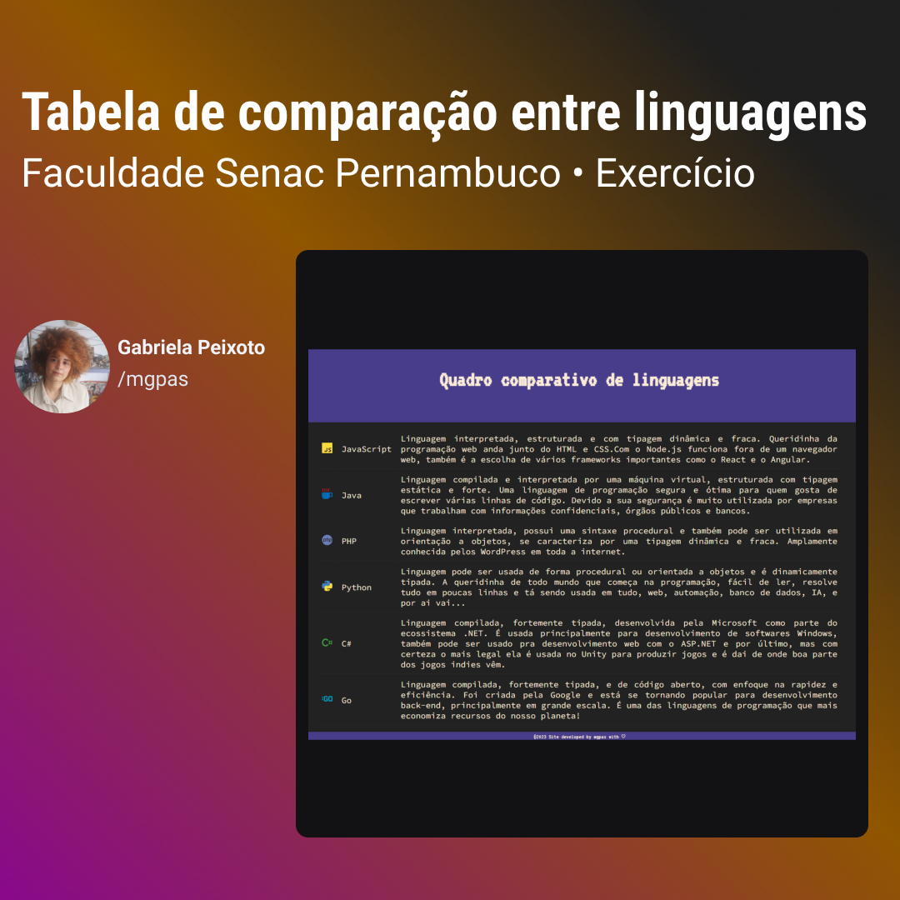

<h1 align="center"> Comparação entre linguagens! </h1>

Quadro de comparação entre linguagens de programação.

  <a href="#-tecnologias">Tecnologias</a>&nbsp;&nbsp;&nbsp;|&nbsp;&nbsp;&nbsp;
  <a href="#-projeto">Projeto</a>&nbsp;&nbsp;&nbsp;|&nbsp;&nbsp;&nbsp;
  <a href="#memo-licença">Licença</a>

  

 

  

## 🚀 Tecnologias

Esse projeto foi desenvolvido com as seguintes tecnologias:

- HTML e CSS
- Git e Github

## 💻 Projeto

Esse projeto foi desenvolvido como parte da disciplina de Coding da Faculdade Senac Pernambuco. Auxiliando no estudo prático de HTML e CSS, além de conceitos sobre programação.

## :memo: Licença

Esse projeto está sob a licença MIT.

---

Feito com ♥ by mgpas :wave:
